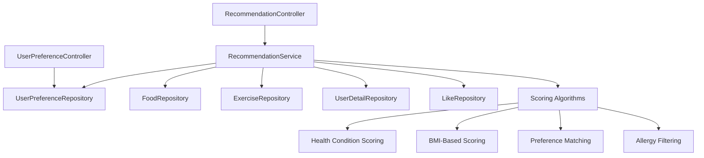

# HealthBuddy Recommendation System

## 📋 Overview

The HealthBuddy Recommendation System provides intelligent, personalized recommendations for foods and exercises based on user health data, preferences, and behavior patterns.

## 🎯 Key Features

### Smart Food Recommendations
- **Health-Condition Based**: Recommendations tailored to specific health conditions (diabetes, hypertension, heart disease, etc.)
- **Allergy Filtering**: Automatically excludes foods containing user allergens
- **BMI-Based Calorie Matching**: Suggests appropriate calorie ranges based on user's BMI
- **Preference Integration**: Considers dietary restrictions, preferred cuisines, and cooking time preferences
- **Difficulty Matching**: Matches recipes to user's cooking skill level

### Intelligent Exercise Recommendations
- **Health-Condition Specific**: Recommends exercises beneficial for user's health conditions
- **BMI-Based Intensity**: Adjusts exercise intensity based on user's BMI and fitness level
- **Muscle Group Targeting**: Focuses on preferred muscle groups and fitness goals
- **Calorie Burn Optimization**: Suggests exercises with appropriate calorie burn rates

### Advanced Algorithms
- **Content-Based Filtering**: Analyzes item features and user preferences
- **Collaborative Filtering**: Learns from similar users' preferences (future enhancement)
- **Health-First Approach**: Prioritizes health benefits over popularity
- **Real-Time Scoring**: Dynamic scoring system with multiple factors

## 🏗️ Architecture

### Core Components



### Data Models

#### UserPreference
- Dietary restrictions and preferences
- Exercise preferences and fitness goals
- Health goals and activity level
- Target metrics (weight, calories)

#### Recommendation DTOs
- FoodRecommendationDTO with scoring and reasoning
- ExerciseRecommendationDTO with personalized metrics
- PersonalizedRecommendationDTO with health summary

## 🔧 API Endpoints

### Recommendation Endpoints
```
GET /api/Recommendation/foods/{userId}?count=10
GET /api/Recommendation/exercises/{userId}?count=10
GET /api/Recommendation/personalized/{userId}?foodCount=5&exerciseCount=5
GET /api/Recommendation/health-summary/{userId}
GET /api/Recommendation/trending/foods?count=10
GET /api/Recommendation/trending/exercises?count=10
POST /api/Recommendation/feedback
```

### User Preference Endpoints
```
GET /api/UserPreference/{userId}
POST /api/UserPreference
PUT /api/UserPreference/{userId}
DELETE /api/UserPreference/{userId}
GET /api/UserPreference/similar-goals?healthGoals=weight_loss
GET /api/UserPreference/activity-level?activityLevel=moderately_active
```

## 🧮 Scoring Algorithm

### Food Scoring (0-100 points)
- **Popularity Score** (0-20): Based on likes and engagement
- **Health Condition Match** (0-30): Specific benefits for user's conditions
- **Allergy Filter** (0 or continue): Excludes allergens completely
- **BMI-Based Calories** (0-25): Matches appropriate calorie ranges
- **Difficulty Preference** (0-15): Matches cooking skill level
- **Cooking Time** (0-10): Prefers shorter preparation times

### Exercise Scoring (0-100 points)
- **Popularity Score** (0-20): Based on likes and engagement
- **Health Condition Match** (0-30): Beneficial for user's conditions
- **BMI-Based Intensity** (0-25): Appropriate intensity level
- **Difficulty Preference** (0-15): Matches fitness level
- **Calorie Burn Efficiency** (0-10): Optimized calorie burn

## 🚀 Usage Examples

### Get Personalized Food Recommendations
```csharp
var recommendations = await _recommendationService
    .GetFoodRecommendationsAsync(userId: 123, count: 10);

foreach (var food in recommendations)
{
    Console.WriteLine($"{food.FoodName}: {food.RecommendationScore} - {food.RecommendationReason}");
}
```

### Set User Preferences
```csharp
var preferences = new AddUserPreferenceRequestDTO
{
    UserId = 123,
    DietaryRestrictions = "[\"vegetarian\", \"low-sodium\"]",
    HealthGoals = "[\"weight_loss\", \"heart_health\"]",
    FitnessLevel = 3,
    ActivityLevel = "moderately_active"
};

await _userPreferenceRepository.CreateOrUpdateUserPreferenceAsync(preferences);
```

## 🔄 Caching Strategy

- **Recommendation Cache**: 30-minute TTL for user recommendations
- **Health Summary Cache**: 1-hour TTL for user health metrics
- **Trending Content**: 2-hour TTL for popular items

## 🎯 Future Enhancements

### Machine Learning Integration
- User behavior pattern analysis
- Advanced collaborative filtering
- Seasonal recommendation adjustments
- A/B testing framework

### Enhanced Personalization
- Time-based recommendations
- Weather-based suggestions
- Social influence factors
- Progress tracking integration

## 📊 Performance Considerations

- Async/await pattern for all database operations
- Memory caching for frequently accessed data
- Efficient database queries with proper indexing
- Pagination for large result sets

## 🧪 Testing Strategy

- Unit tests for scoring algorithms
- Integration tests for API endpoints
- Performance tests for recommendation generation
- User acceptance testing for recommendation quality
