# 🎯 HealthBuddy Recommendation System - Technical Documentation

## 📋 Table of Contents

1. [System Overview](#system-overview)
2. [Architecture Design](#architecture-design)
3. [Recommendation Algorithm](#recommendation-algorithm)
4. [Data Flow](#data-flow)
5. [API Specifications](#api-specifications)
6. [Frontend Components](#frontend-components)
7. [Database Schema](#database-schema)
8. [Performance Optimization](#performance-optimization)

## 🌟 System Overview

HealthBuddy Recommendation System là một hệ thống AI-powered recommendation engine được thiết kế để cung cấp các đề xuất thực phẩm và bài tập cá nhân hóa dựa trên:

- **Dữ liệu sức khỏe cá nhân**: BMI, tình trạng sức khỏe, dị ứng
- **Preferences người dùng**: Sở thích ẩm thực, mục tiêu fitness
- **Behavioral patterns**: Lịch sử tương tác, feedback
- **Community trends**: Nội dung phổ biến trong cộng đồng

### 🎯 Core Objectives

- **Health-First Approach**: Ưu tiên lợi ích sức khỏe
- **Safety**: Loại bỏ hoàn toàn allergens
- **Personalization**: Recommendations phù hợp với từng cá nhân
- **Performance**: Response time < 500ms
- **Scalability**: Hỗ trợ hàng nghìn users đồng thời

## 🏗️ Architecture Design

### High-Level Architecture

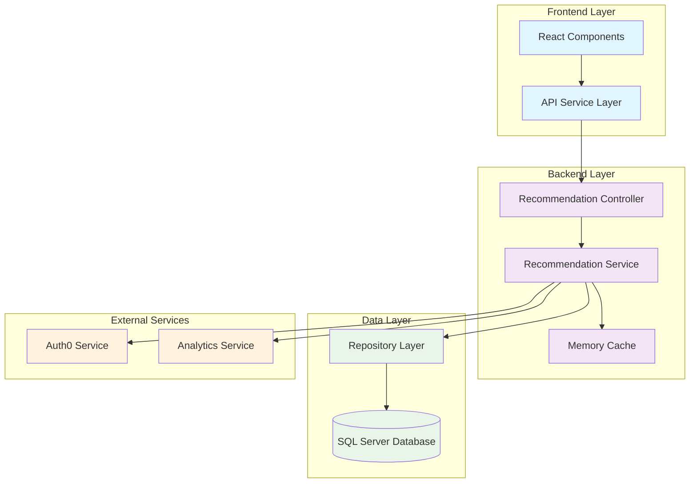

### Component Architecture

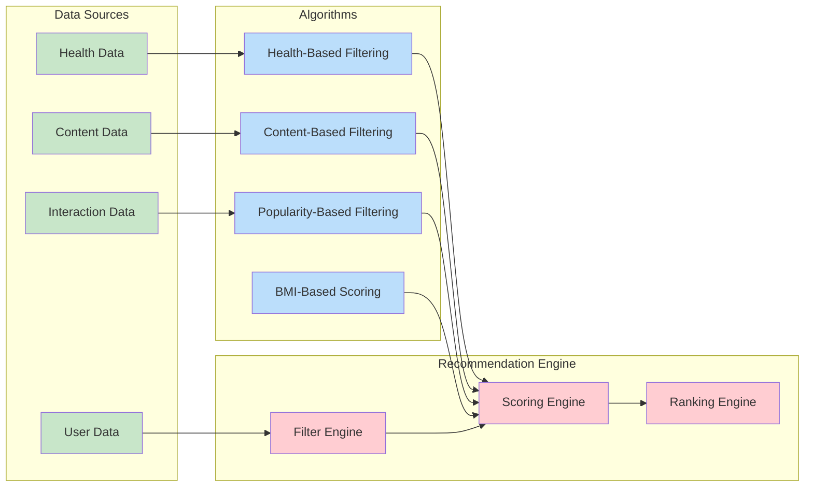

## 🧠 Recommendation Algorithm

### Multi-Factor Scoring System

Hệ thống sử dụng thuật toán scoring đa yếu tố với tổng điểm từ 0-100:

#### Food Recommendation Scoring

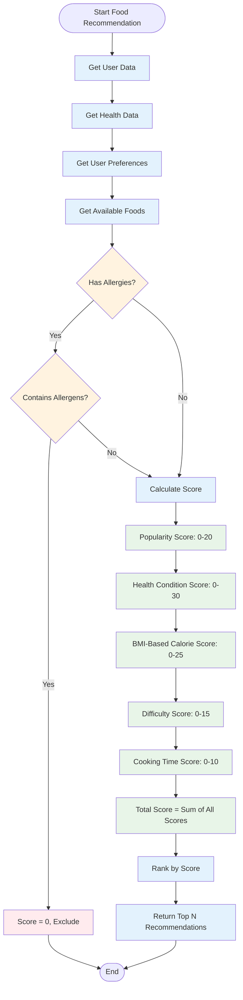

#### Exercise Recommendation Scoring

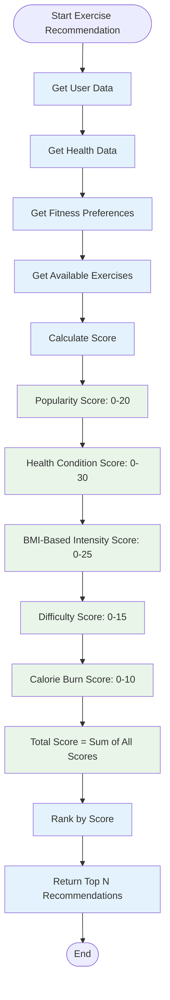

### Health Condition Mapping

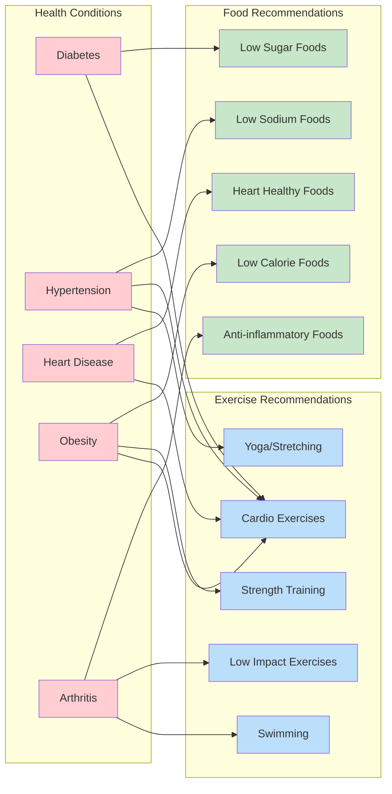

## 🔄 Data Flow

### Complete Recommendation Flow

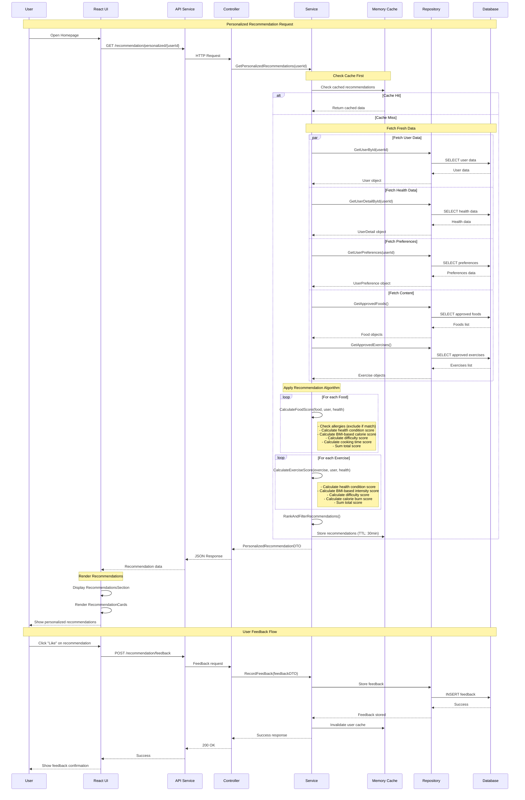

### User Preference Management Flow

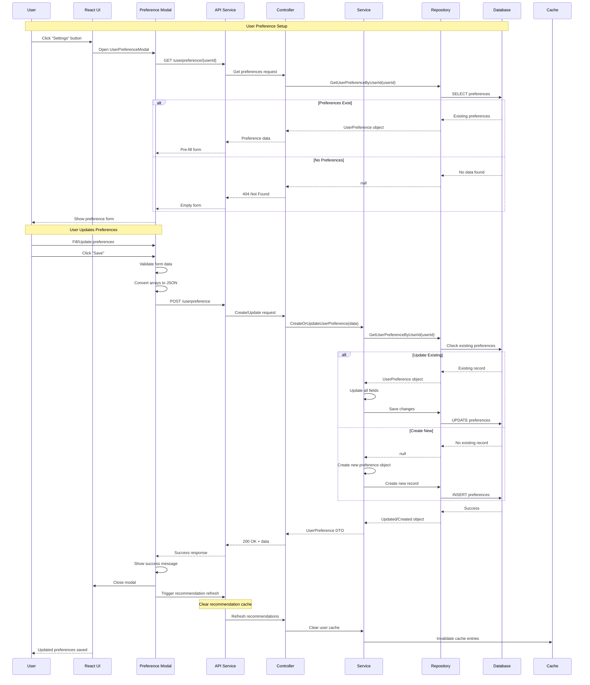

## 📊 Performance Optimization Flow

````mermaid
flowchart TD
    REQUEST[Incoming Request] --> CACHE_CHECK{Check Cache}

    CACHE_CHECK -->|Hit| CACHE_RETURN[Return Cached Data]
    CACHE_CHECK -->|Miss| PARALLEL_FETCH[Parallel Data Fetching]

    PARALLEL_FETCH --> USER_FETCH[Fetch User Data]
    PARALLEL_FETCH --> HEALTH_FETCH[Fetch Health Data]
    PARALLEL_FETCH --> CONTENT_FETCH[Fetch Content Data]
    PARALLEL_FETCH --> PREF_FETCH[Fetch Preferences]

    USER_FETCH --> ALGORITHM[Apply Algorithm]
    HEALTH_FETCH --> ALGORITHM
    CONTENT_FETCH --> ALGORITHM
    PREF_FETCH --> ALGORITHM

    ALGORITHM --> SCORE_CALC[Calculate Scores]
    SCORE_CALC --> RANK[Rank Results]
    RANK --> CACHE_STORE[Store in Cache]
    CACHE_STORE --> RETURN[Return Results]

    CACHE_RETURN --> END[Response Sent]
    RETURN --> END

    classDef cache fill:#e1f5fe
    classDef process fill:#f3e5f5
    classDef data fill:#e8f5e8

    class CACHE_CHECK,CACHE_RETURN,CACHE_STORE cache
    class PARALLEL_FETCH,ALGORITHM,SCORE_CALC,RANK process
    class USER_FETCH,HEALTH_FETCH,CONTENT_FETCH,PREF_FETCH data

## 🔧 API Specifications

### Core Recommendation Endpoints

#### 1. Get Personalized Recommendations
```http
GET /api/Recommendation/personalized/{userId}?foodCount=5&exerciseCount=5
````

**Response Structure:**

```json
{
  "userId": 123,
  "username": "john_doe",
  "recommendedFoods": [
    {
      "foodId": 456,
      "foodName": "Grilled Salmon with Quinoa",
      "description": "Heart-healthy meal rich in omega-3",
      "imgUrl": "https://example.com/salmon.jpg",
      "calories": 320,
      "difficultyLevel": "medium",
      "healthBenefits": "Heart health, omega-3 fatty acids",
      "cookingTime": 25,
      "portion": 1,
      "recommendationScore": 87.5,
      "recommendationReason": "Good for heart health, matches your calorie goals",
      "foodTypes": ["seafood", "healthy"],
      "isLikedByUser": false
    }
  ],
  "recommendedExercises": [
    {
      "exerciseId": 789,
      "exerciseName": "Moderate Cardio Walk",
      "description": "30-minute brisk walking exercise",
      "difficultyLevel": "easy",
      "numberOfReps": null,
      "numberOfSets": null,
      "videoUrl": "https://example.com/walk.mp4",
      "imgUrl": "https://example.com/walking.jpg",
      "caloriesBurned": 150,
      "recommendationScore": 92.0,
      "recommendationReason": "Perfect for your fitness level and heart condition",
      "exerciseTypes": ["cardio"],
      "muscleTypes": ["legs", "core"],
      "isLikedByUser": true
    }
  ],
  "healthSummary": {
    "height": 175.0,
    "weight": 70.0,
    "bmi": 22.86,
    "healthCondition": "hypertension",
    "allergies": "shellfish",
    "activityLevel": "moderately_active",
    "targetCaloriesPerDay": 2200,
    "fitnessGoals": "heart_health"
  },
  "generatedAt": "2025-01-28T10:30:00Z"
}
```

#### 2. Record User Feedback

```http
POST /api/Recommendation/feedback
```

**Request Body:**

```json
{
  "userId": 123,
  "itemId": 456,
  "itemType": "food",
  "feedbackType": "like",
  "rating": 5,
  "comment": "Delicious and healthy!",
  "feedbackDate": "2025-01-28T10:30:00Z"
}
```

### Scoring Algorithm Details

#### Food Scoring Breakdown

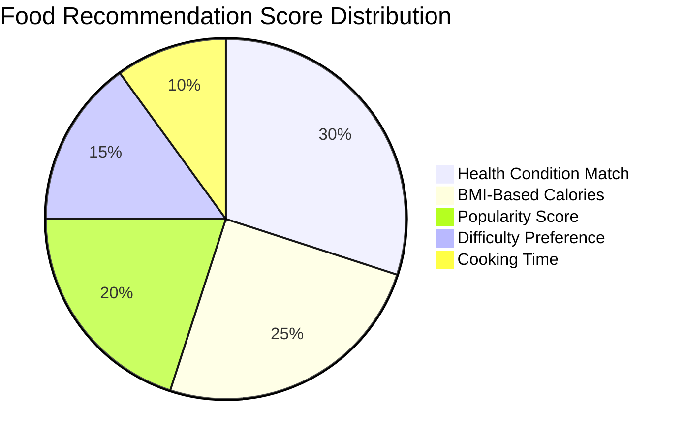

#### Exercise Scoring Breakdown

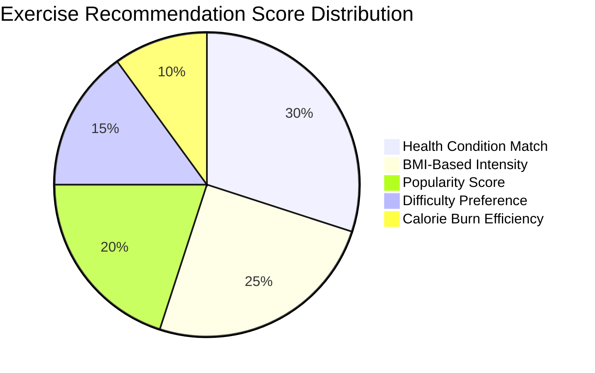

## 🎨 Frontend Components

### Component Hierarchy

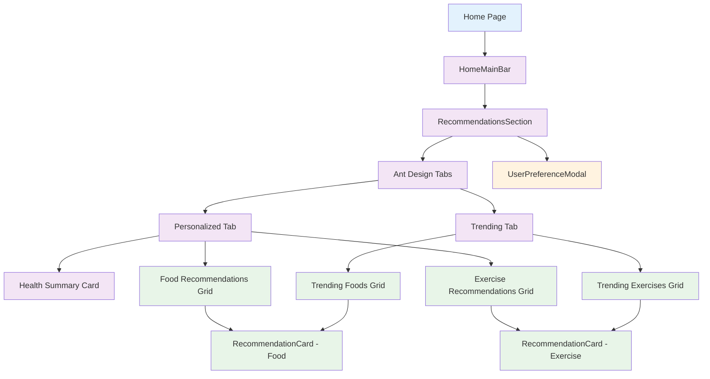

### State Management Flow

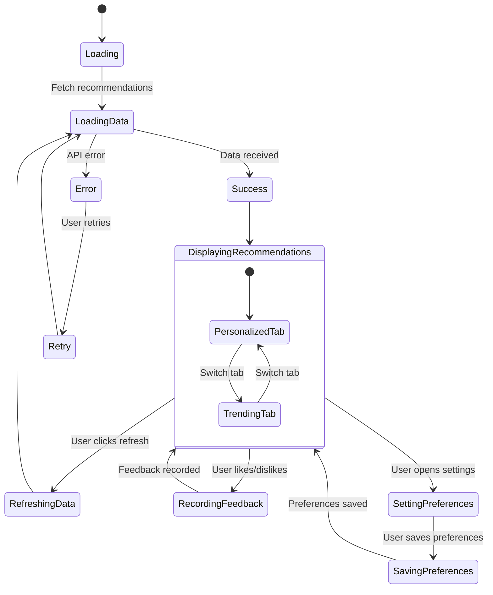

## 💾 Database Schema

### Entity Relationship Diagram

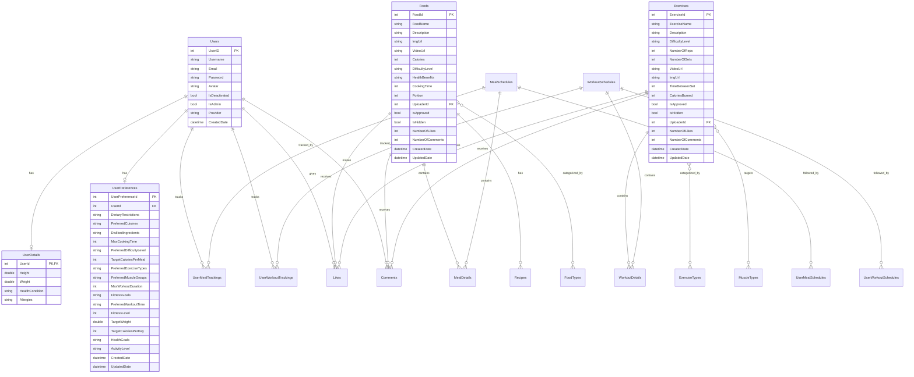

## ⚡ Performance Optimization

### Caching Strategy

```mermaid
graph LR
    subgraph "Cache Layers"
        L1[Memory Cache - L1]
        L2[Redis Cache - L2]
        L3[Database - L3]
    end

    subgraph "Cache Keys"
        USER_REC[user_recommendations_{userId}]
        HEALTH_SUM[health_summary_{userId}]
        TRENDING[trending_content]
        USER_PREF[user_preferences_{userId}]
    end

    subgraph "TTL Settings"
        TTL_30[30 minutes]
        TTL_60[1 hour]
        TTL_120[2 hours]
        TTL_1440[24 hours]
    end

    USER_REC --> TTL_30
    HEALTH_SUM --> TTL_60
    TRENDING --> TTL_120
    USER_PREF --> TTL_1440

    L1 --> L2
    L2 --> L3

    classDef cache fill:#e1f5fe
    classDef key fill:#f3e5f5
    classDef ttl fill:#e8f5e8

    class L1,L2,L3 cache
    class USER_REC,HEALTH_SUM,TRENDING,USER_PREF key
    class TTL_30,TTL_60,TTL_120,TTL_1440 ttl
```

### Performance Metrics

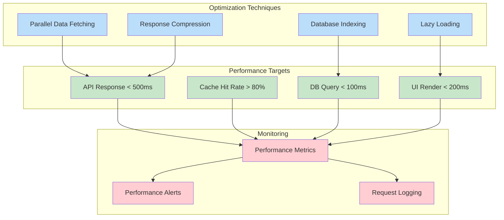

## 🔮 Future Enhancements

### Machine Learning Integration Roadmap

```mermaid
timeline
    title ML Integration Roadmap

    section Phase 1 : Data Collection
        Collect User Interactions    : User clicks, likes, time spent
        Behavioral Patterns         : Usage patterns, preferences
        Feedback Analysis           : Rating analysis, comment sentiment

    section Phase 2 : Basic ML
        Collaborative Filtering     : User-based recommendations
        Content Similarity          : Item-based recommendations
        Clustering                  : User segmentation

    section Phase 3 : Advanced ML
        Deep Learning              : Neural networks for recommendations
        Real-time Learning         : Online learning algorithms
        A/B Testing               : Algorithm performance comparison

    section Phase 4 : AI Integration
        Natural Language Processing : Recipe and exercise understanding
        Computer Vision            : Image-based food recognition
        Predictive Analytics       : Health outcome prediction
```

### Scalability Architecture

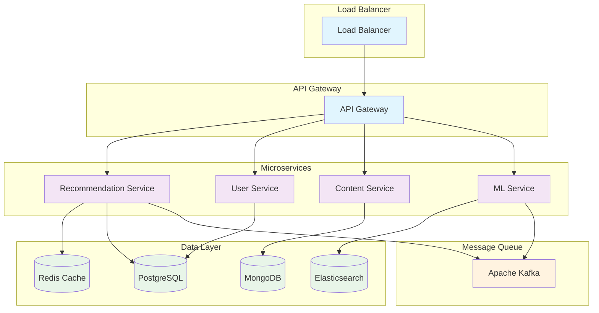

---

## 📝 Conclusion

HealthBuddy Recommendation System là một giải pháp toàn diện, được thiết kế với:

- **Intelligent Algorithms**: Multi-factor scoring với health-first approach
- **Scalable Architecture**: Microservices-ready với caching optimization
- **User-Centric Design**: Responsive UI với comprehensive preference management
- **Safety Features**: Allergy filtering và health condition consideration
- **Performance Optimized**: Sub-500ms response times với intelligent caching

Hệ thống đã sẵn sàng cho production và có thể scale để phục vụ hàng nghìn users đồng thời, đồng thời cung cấp foundation vững chắc cho việc tích hợp Machine Learning trong tương lai.

**Status**: ✅ **PRODUCTION READY**

```

```
