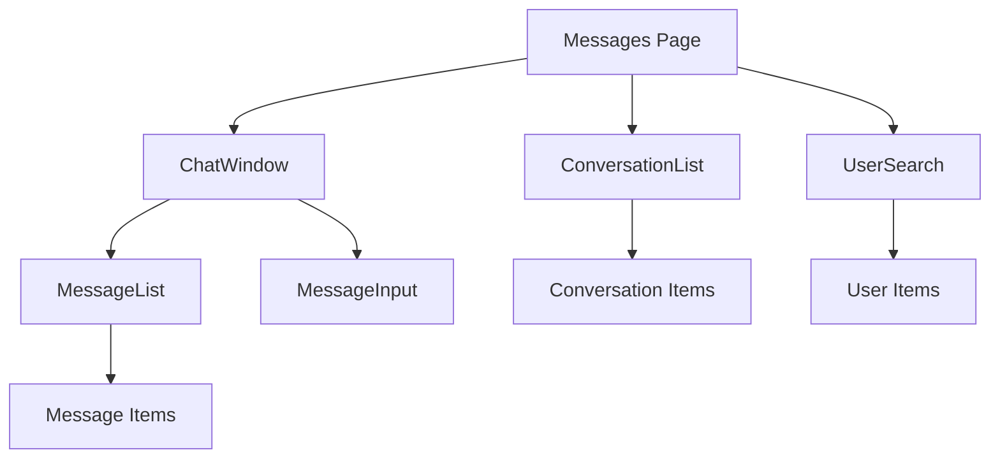
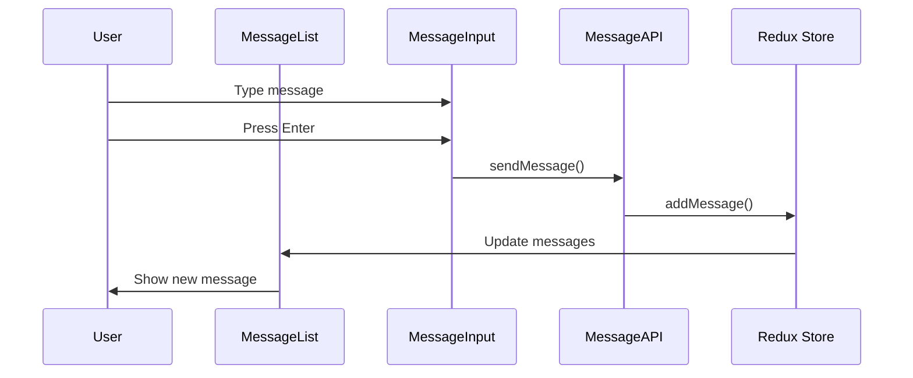
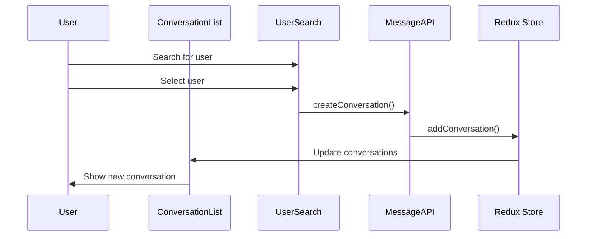

# Messaging System Components

## Overview
This folder contains all components related to the messaging system in HealthBuddy. The messaging system allows users to have 1-on-1 conversations with each other.

## Key Components

### ConversationList
- **Purpose**: Displays a list of user's conversations
- **Features**: 
  - Shows other participant's avatar and name
  - Displays last message preview
  - Shows last message timestamp
  - Highlights selected conversation
- **Props**: conversations, currentUserId, onConversationSelect, selectedConversationId, isLoading

### MessageList
- **Purpose**: Displays messages in a conversation
- **Features**:
  - Shows messages with sender info
  - Displays timestamps
  - Supports pagination (load more messages)
  - Auto-scrolls to bottom for new messages
  - Date separators
- **Props**: messages, currentUserId, isLoading, hasMoreMessages, onLoadMore, isLoadingMore

### MessageInput
- **Purpose**: Input component for sending messages
- **Features**:
  - Text area with auto-resize
  - Character count (max 1000)
  - Send button
  - Enter to send, Shift+Enter for new line
  - Validation
- **Props**: onSendMessage, disabled

### ChatWindow
- **Purpose**: Main chat interface combining message list and input
- **Features**:
  - Header with participant info
  - Message list with pagination
  - Message input
  - Refresh functionality
  - Error handling
- **Props**: conversation, onBack

### UserSearch
- **Purpose**: Modal for searching and selecting users to start conversations
- **Features**:
  - Search users by name or email
  - Debounced search
  - User list with avatars
  - Click to start conversation
- **Props**: visible, onClose, onUserSelect, currentUserId

## Mermaid Diagrams

### Component Hierarchy

### Message Flow

### Conversation Flow

## State Management
- Uses Redux for state management
- messageSlice handles:
  - conversations list
  - current conversation
  - messages
  - loading states
  - pagination

## API Integration
- MessageAPI service handles all API calls
- Endpoints used:
  - GET /api/Message/conversations/{userId}
  - GET /api/Message/conversation/{conversationId}/messages
  - POST /api/Message/send
  - POST /api/Message/conversation

## Features
- ✅ 1-on-1 conversations
- ✅ Text messages only
- ✅ Message pagination
- ✅ User search
- ✅ Responsive design
- ✅ Dark mode support
- ✅ Real-time updates via refresh
- ❌ Group chat (not implemented)
- ❌ File sharing (not implemented)
- ❌ Real-time notifications (not implemented)
